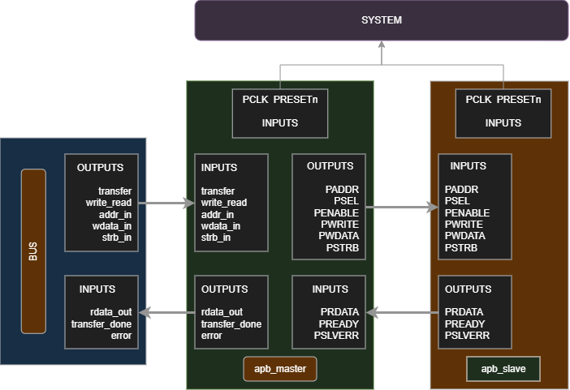
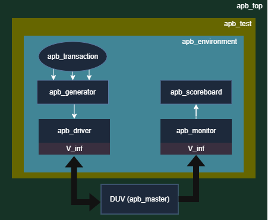

# APB Master Verification

## About AMBA APB

The **Advanced Peripheral Bus (APB)** is part of the ARM AMBA (Advanced Microcontroller Bus Architecture) family and is designed for communication with low-bandwidth, low-power peripheral devices. APB provides a simple, non-pipelined interface with minimal control signals, making it suitable for peripherals such as timers, UARTs, GPIOs, and interrupt controllers. An APB transaction consists of two phases: **SETUP** and **ACCESS**, ensuring straightforward and reliable communication between an APB master and one or more APB slaves.

<p align="center">
  
</p>

---

# Verification Components

| Component | Description |
|-----------|-------------|
| `apb_defines.svh` | Stores global macros, parameters, and utility definitions used throughout the project. |
| `apb_package.sv` | Contains all class definitions required by the verification environment. |
| `apb_interface.sv` | Defines the APB interface and clocking blocks used by the driver, monitor, and reference model. |
| `apb_top` | Top-level testbench module that instantiates the DUT, interface, clock, reset, and test environment. |
| `apb_test.sv` | Creates the verification environment and starts the execution of the test. |
| `apb_environment.sv` | Instantiates and connects all verification components including mailboxes and virtual interfaces. |
| `apb_transaction.sv` | Defines the APB transaction object containing randomized stimulus and response information. |
| `apb_generator.sv` | Generates constrained-random APB transactions and sends them to the driver. |
| `apb_driver.sv` | Drives APB transactions onto the DUT through the virtual interface. |
| `apb_master.v` | RTL implementation of the APB Master Design Under Test (DUT). |
| `apb_reference_model.sv` | Models the expected APB master behavior and generates reference results. |
| `apb_monitor.sv` | Monitors DUT interface activity and converts signal activity into transaction objects. |
| `apb_scoreboard.sv` | Compares DUT outputs with the reference model and reports mismatches. |

---

# Testbench Architecture

The verification environment follows a reusable SystemVerilog class-based architecture. The generator creates randomized APB transactions, which are driven to the DUT by the driver. The monitor samples DUT activity and forwards observed transactions to both the scoreboard and the reference model. The reference model predicts expected behavior, while the scoreboard compares expected and actual results to verify functional correctness.

<p align="center">
  
</p>

---

# Directory Structure

```text
apb_master/
├── README.md
├── docs/
│   ├── README.md
│   └── images/
│       ├── apb.png
│       ├── testbench_archihtecture.png
│       └── README.md
└── src/
    ├── design/
    │   ├── apb_master.v
    │   └── README.md
    ├── verification/
    │   ├── apb_defines.svh
    │   ├── apb_interface.sv
    │   ├── apb_transaction.sv
    │   ├── apb_generator.sv
    │   ├── apb_driver.sv
    │   ├── apb_monitor.sv
    │   ├── apb_reference_model.sv
    │   ├── apb_scoreboard.sv
    │   ├── apb_environment.sv
    │   ├── apb_test.sv
    │   ├── apb_package.sv
    │   ├── apb_top.sv
    │   └── README.md
    └── simulation/
        ├── README.md
        ├── log_file.log
        ├── transcript
        ├── ucdb_file.ucdb
        └── covReport/
```

---

# Running the Simulation (QuestaSim)

Compile the design and verification environment:

```bash
vlog -sv +acc +cover +fcover -l log_file.log apb_top.sv
```

Run the simulation with coverage enabled:

```bash
vsim -vopt work.apb_top -voptargs=+acc=npr -assertdebug -l log_file.log -coverage -c -do "coverage save -onexit -assert -directive -cvg -codeAll ucdb_file.ucdb; run -all; exit"
```

Generate the coverage report:

```bash
vcover report -html ucdb_file.ucdb -htmldir covReport -details
```

---

## Simulator

- **Simulator:** QuestaSim 
- **Language:** SystemVerilog
- **Verification Methodology:** Class-Based Verification Environment
